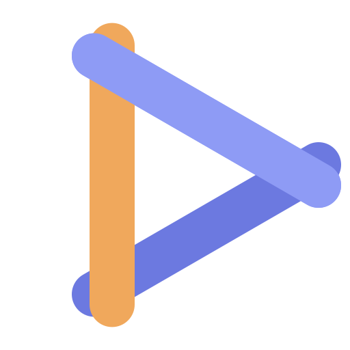
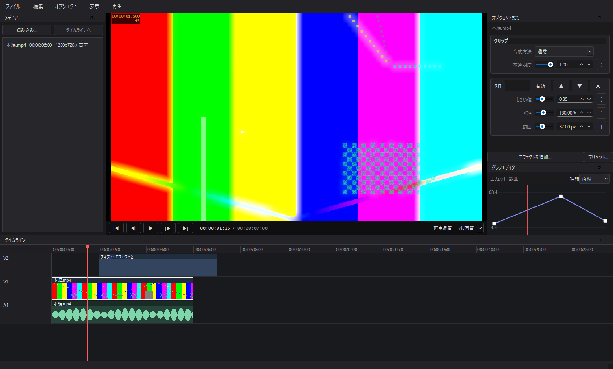
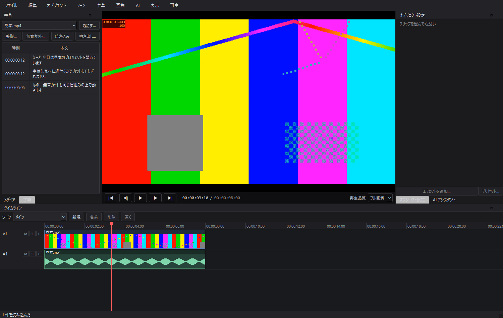
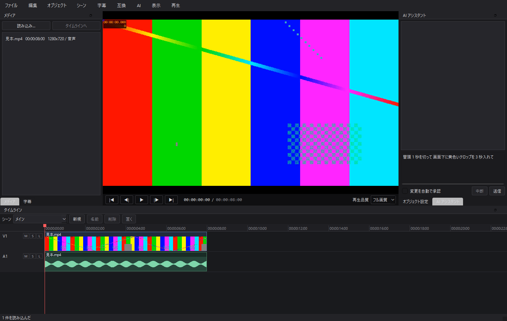
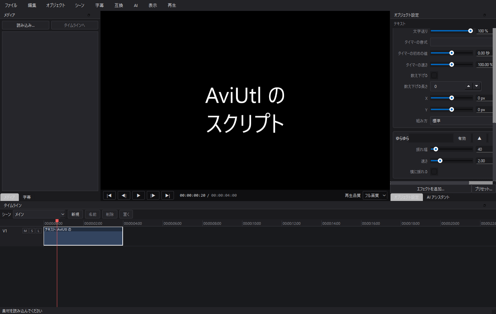
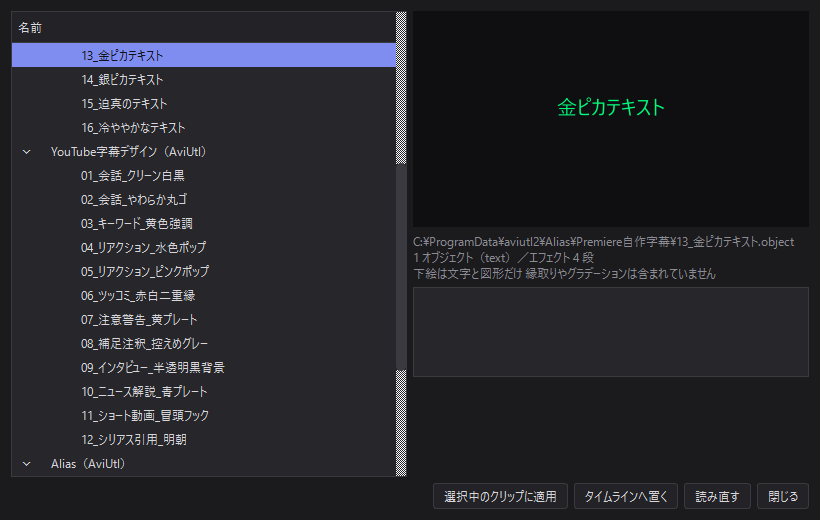
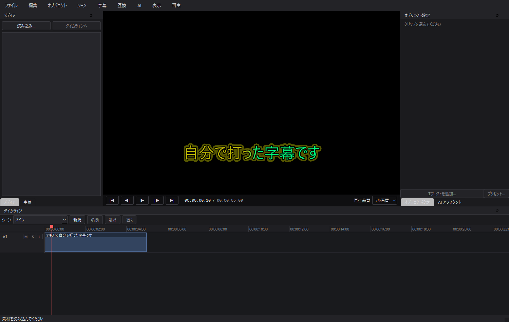
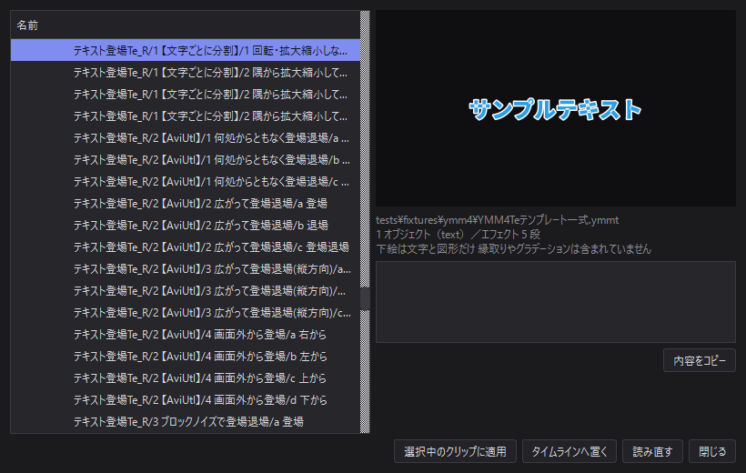
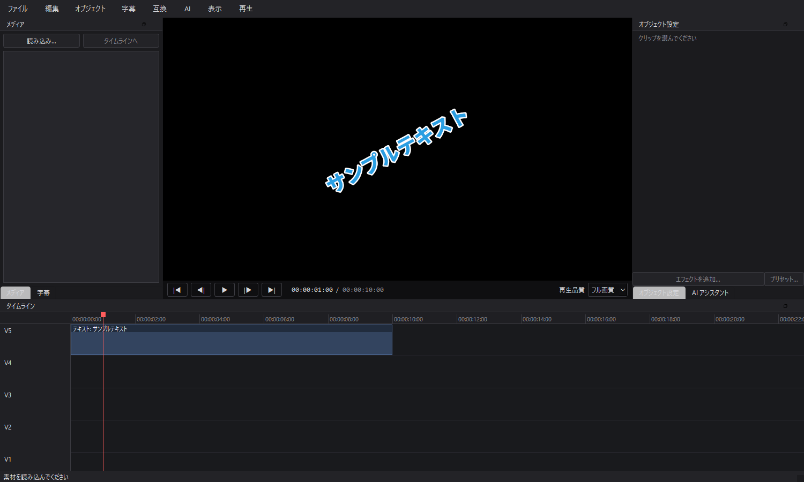

# Sashimono Edit（指物）

[](https://github.com/kagemorikosame/sashimono-edit/actions/workflows/ci.yml) [](LICENSE)

Python 製の動画編集ソフト AviUtl の表現力、Premiere の操作性、AI エージェントによる編集自動化を 1 つにまとめることを目指しています

<br clear="left">

名前は日本の木工技法「組木」から 釘を使わず、小さな木片を組み合わせて 1 つの形にする技法です
小さな素材を組み上げて 1 本の動画にすること、そして AviUtl のスクリプトや YMM4 のテンプレートと
自作のものが同じ仕組みに嵌まることの両方を指しています
ロゴの三本の棒は互いに組まれていて、中央の空きが再生の記号になっています



## 現状

**P6（YMM4 互換）まで完成** 素材の読み込みからカット編集、エフェクト、字幕、AI への指示、AviUtl スクリプトの実行、配布テンプレートの適用、書き出しまでが一本通る

- 素材の読み込み（D&D / メニュー）と、映像・音声のリンクした自動配置
- タイムライン: 動画サムネイル・音声波形の表示、拡大縮小、スクラブ
- カット編集: 分割（S）、削除（Del）、詰めて削除（Shift+Del）、ドラッグ移動、端のトリム
- GPU 合成によるプレビュー（リニア空間、再生品質の切り替え）
- 音声再生（オーディオを時計にした A/V 同期）
- NVENC / CPU での書き出し
- プロジェクトの保存・読み込み（`.sme`）と Undo / Redo
- エフェクト 80 種 標準の 17 種（色調補正・ぼかし・方向ぼかし・グロー・クロマキー・輝度キー・変形・クリッピング・縁取り・影・グラデーション・単色塗り・不透明度・シャープ・ノイズ・モザイク・マスク）に、YMM4 の配布物と本体の絵に合わせた動き 24 種（ランダム・反復・登場と退場・跳ねる・渦巻き・波・破片・残像・パーティクル ほか）と加工 39 種（模様で塗る・ノイズ・縁の反射・内側の影と縁取り・網点・グリッチ・長い影・魚眼・波紋・極座標・引き伸ばし・レンズぼかし ほか）
- 合成モード 26 種（通常・加算・減算・乗算・スクリーン・オーバーレイ・ソフトライト・焼き込み・比較(明)(暗)・差の絶対値・色相・輝度 ほか）と、板を傾ける X 軸・Y 軸の回転
- 場面切り替え（前の場面と後の場面を切り替え・クロスフェード・押し出し・スライド・重ねるで混ぜる 前後それぞれにエフェクトを積める）
- シーン（別のタイムラインを 1 本のクリップとして入れ子に置く）と、クリップのグループ（束ねてまとめて選ぶ・動かす）
- キーフレームアニメーションとグラフエディタ（直線・曲線・加減速・瞬間移動）
- テキストと図形オブジェクト（縁取り・影・行揃え・縦の基準・縦書き・文字送り・時間を数えるタイマー、13 種の図形）
- パラメータ定義から自動生成される設定 UI
- エフェクト構成のプリセット保存（`.smep`）
- 字幕起こし（faster-whisper）、フィラー語の除去と改行整形、無音カット、SRT / VTT / テキスト書き出し、タイムラインへの焼き込み
- ソフト内の AI アシスタント 話しかけると実際に編集し、結果を自分で見て確認する
- AviUtl のスクリプト実行（Lua 5.1）と、`.exo` / `.exa` / `.object` の読み込み
- 配布テンプレートの棚 AviUtl2 のエイリアスと YMM4 のアイテムテンプレート（`.ymmt`）を並べ、
  タイムラインへ置くか、**今ある字幕に見た目だけ着せる**

未着手: P7（プロキシ・バックグラウンドレンダ・GPU 最適化・プラグイン SDK・パッケージング）

### エフェクトの定義について

パラメータの仕様は AviUtl のスクリプト制御文字（`--track@` `--check@` `--color@` など）と
1 対 1 に対応させてあります 自前のエフェクトも配布スクリプトも同じ定義形式に載るので、
設定 UI の自動生成もプリセットの保存も 1 つの実装で済みます

## 字幕



字幕は**トラックではなく素材に紐付きます** タイムライン上のどこに出るかは、その素材を
参照しているクリップごとに毎回計算する（投影する）ので、カット・分割・移動・速度変更の
どれをしても字幕はずれません 追従処理を書いていないのではなく、**位置を持たせないので
ずれようがない**という作りです

| やること | どうなるか |
|---|---|
| 起こす | 素材の音声を認識して、素材に字幕を持たせる |
| 整形する | 「えーと」などのフィラー語を落とし、句読点と改行位置を整える |
| 無音カット | 波形の無音区間を検出し、タイムラインからまとめて削って詰める（1 回の Undo で戻せる） |
| 焼き込み | いま画面に出ている字幕を、テキストオブジェクトとしてタイムラインへ並べる |
| 書き出し | SRT / WebVTT / 素のテキスト 時刻は編集後のタイムライン基準 |

無音カットは、起こし結果がある場合「文字を起こせている区間は切らない」を選べます
波形だけでは小さな声と環境音を区別できないので、これを入れるとしきい値を強気にできます

### 起こしの実行環境は、初期状態では入っていません

音声認識の依存（faster-whisper と CUDA ランタイム）は合計で 2 GB を超えます 字幕を使わない
人にまで配布サイズを負担させたくないので、**既定では同梱せず、必要になった時点でソフト内から
導入する**方針です

字幕パネルの「起こす…」を開くと、未導入なら「環境を導入」ボタンが出ます 押すと入るものと
実行するコマンドを表示してから `pip` を子プロセスで走らせ、その出力をそのまま画面に流します
GPU を使わない選択もでき、その場合は CUDA ランタイム（約 1.7 GB）を落とさずに済みます

導入せずに使える範囲:

- すでにある字幕の編集・整形・分割・結合
- 無音カット（波形だけで動きます）
- 字幕ファイルの書き出しと焼き込み

自分で入れる場合は次のとおりです ソフト内のボタンはこれと同じことをします

```bash
.venv\Scripts\python.exe -m pip install -e ".[asr]"
```

パッケージ版（PyInstaller）では実行ファイルの中へは書き込めないので、
`%LOCALAPPDATA%\Sashimono\runtime` へ入れ、起動時にそのフォルダを import パスへ足します

## AI アシスタント



編集画面の中で Claude と話し、**実際の編集操作をさせられます** 「冒頭 1 秒を切って」
「画面下に黄色いテロップを 3 秒入れて」のように書くと、その場でタイムラインが変わります

仕組みは MCP です 編集操作をアプリ内の MCP サーバとして公開し、Claude Agent SDK 経由で
繋いでいます 外部プロセスにしていないのは、編集中のプロジェクトがメモリ上にしか無いため
ファイル越しに渡すと、保存していない状態を触れなくなります

**AI は自分の編集結果を見られます** `preview_frame` を呼ぶとその位置を GPU で合成して
画像で返すので、「値は合っているが見た目が違う」に気付けます これが無いと当てずっぽうに
なります 描く前に再生は止まります

安全のための決まりごと:

| 決まり | 中身 |
|---|---|
| 1 指示 = 1 取り消し | AI が何十回操作しても、Undo 1 回で指示の前に戻ります |
| 変更には確認 | 読み取りは自由、タイムラインを変える操作は許可を求めます（自動承認も選べます） |
| 使えるのは編集操作だけ | ファイル読み書き・シェル・Web は全部止めてあります |
| 中断できる | 生成中でも確認待ちでも、中断ボタンで畳めます |

AI に見せている操作は 43 種類（読み取り 15 / 変更 28）で、UI と同じ `Command` を通ります
シーンを開けば、AI の読み取りと編集もそのシーンのタイムラインが相手になります
UI からできて AI からできない、その逆、が生まれない作りです

### こちらも初期状態では未導入です

Claude Agent SDK（約 40 MB）と、実行に必要な **Claude Code 本体**が要ります 字幕起こしと
同じく、AI パネルの「環境を導入」から入れられます Claude Code 本体は npm から入れてください

```bash
npm install -g @anthropic-ai/claude-code
```

自分で入れる場合は次のとおりです

```bash
.venv\Scripts\python.exe -m pip install -e ".[ai]"
```


## AviUtl 互換



AviUtl のアニメーション効果（`.anm` / `.anm2`）をそのまま実行できます 上の画面の
「ゆらゆら」「残像」は Lua スクリプトで、**設定欄のコードは 1 行も書いていません**
スクリプトの先頭にある制御文字から自動で組み立てています

```
--track0:振れ幅,0,500,40,1
--track1:速さ,0.1,10,2,0.1
--check0:横に揺れる,0
```

この 3 行が、そのまま右のパネルのスライダーとチェックボックスになります P2 で
パラメータ定義を AviUtl の制御文字と 1 対 1 に対応させておいたので、設定 UI も
プリセットもキーフレームも自前のエフェクトとまったく同じ経路に乗ります

### 実行環境

**Lua は最初から入っています**（`lupa`） 字幕起こしや AI 連携と違い、追加導入は
要りません 互換機能の土台なので、既定が「スクリプトが動かない状態」では意味が
ないためです

使うのは **Lua 5.1** AviUtl 本体と同じで、配布スクリプトが普通に使う `unpack` や
`setfenv` がそのまま動きます

### できること

| | |
|---|---|
| スクリプト実行 | `.anm` `.obj` `.scn` `.cam` `.tra` と AviUtl2 世代の `2` 付き |
| 制御文字 | `--track` `--check` `--color` `--file` `--font` `--text` `--select` `--value` `--figure` `--dialog`（`/chk` `/col` `/fig`）`--param` `--label` |
| `obj` API | 座標・回転・拡大・不透明度・アスペクト・軸ごとの倍率、`draw` `effect` `load` `mes` `setfont` `copybuffer` `getpixel` `putpixel` `getvalue` `getoption` `rand` `interpolation` `module` ほか |
| 補助関数 | `RGB` `HSV` `OR` `AND` `XOR` `SHIFT` `require` `debug_print` |
| オブジェクト | `.exo` / `.exa` の読み込み（テキスト・図形・フィルタ・描画設定・レイヤー） |
| 文字コード | Shift_JIS と UTF-8 を中身から自動判別 |

スクリプトは `%APPDATA%\Sashimono\scripts` に置きます AviUtl2 が入っていれば
`%PROGRAMDATA%\aviutl2\Script` も自動で見に行くので、**手元の資産をコピーせずに
そのまま使えます**

### 安全のための決まりごと

配布スクリプトは他人が書いたコードで、読み込むだけで実行されます

- `io` `os` 素の `require` `dofile` を外し、ファイルにもプロセスにも触れません
- `obj.module` と `require` はスクリプトフォルダの中だけを探します
- 実行の命令数に上限があります 無限ループを書いたスクリプトを掴んでも、
  編集画面は固まらず、そのオブジェクトだけ素通しで出ます

### 動かないものは一覧で分かります

`obj` API は広く、全部を一度に実装することはできません 大事なのは「動かない」
ことではなく**何が足りないかが分かること**なので、未対応の関数が呼ばれたら
落とさずに記録します 〔互換〕→〔互換性レポート…〕に、使われた回数つきで並びます

現時点で分かっている大きな穴:

- `obj.getpixeldata` / `putpixeldata`（画像全体の生データ）
- **native モジュール（`.mod2` の中身が DLL のもの）** — AviUtl2 の Lua に合わせて
  作られた実行ファイルなので、こちらでは動かせません 読み込もうとしたことは
  記録に残ります

手元にあった実配布スクリプト 11 本のうち 8 本が実行できました 残り 3 本は
すべて native モジュールを要求するものです

`obj.drawpoly`（任意の四角形へ貼る）、`obj.rx` `obj.ry` `obj.oz`（板を傾ける・奥へ置く）、
テキスト欄に埋め込んだ Lua（`<?mes(…)?>`）、合成モードの オーバーレイ・比較(明)・比較(暗)・減算 も
効きます

## テンプレート（AviUtl2 エイリアス / YMM4）



〔互換〕→〔テンプレート…〕（Ctrl+Shift+D）で開きます 集めてくるのは 2 種類です

- AviUtl のエイリアス — `%PROGRAMDATA%\aviutl2\Alias` にある `.exa` `.exa2` `.object`
- YMM4 のアイテムテンプレート — `%LOCALAPPDATA%\YukkuriMovieMaker\ItemTemplate` の `.ymmt`

自分で追加するものは `%APPDATA%\Sashimono\templates` に置いてください

### 「置く」と「着せる」

配布されている字幕デザインは、見本の文字（`字幕テキスト` など）が入った
テキストオブジェクトとして配られています そのまま置くと毎回打ち直すことに
なるので、使い方を 2 通り用意しました

- **タイムラインへ置く** — 見本の文字ごと再生位置へ置く 新しくテロップを作るとき
- **選択中のクリップに適用** — 今の文字と長さはそのままに、**見た目だけ**入れ替える

後者が本命です すでに打ってある字幕（起こした字幕も含む）を選んでから適用すると、
フォント・サイズ・色・装飾・積まれているエフェクトだけが入れ替わります
どちらも 1 回の操作なので、Undo 1 回で元に戻ります



上の画面の文字は自分で打ったもので、金色のグラデーションと二重の縁取りは
`13_金ピカテキスト.object` から来ています 位置（画面下から 380px）も
エイリアスの指定どおりです

### AviUtl2 世代の書き方

`.object` は AviUtl1 の `.exa` とは別物で、読み方が 4 か所違います

| | AviUtl1（`.exa`） | AviUtl2（`.object`） |
|---|---|---|
| 節の名前 | `[0]` `[0.1]` | `[Object]` `[Object.1]` |
| 要素の名前 | `_name=テキスト` | `effect.name=テキスト` |
| 区間 | `start=1` `end=60`（1 始まり） | `frame=0,179`（0 始まり） |
| テキスト欄 | UTF-16LE の 16 進 | 素のまま（改行は `\n`） |

パラメータ名も日本語になります（`サイズ` `字間` `文字色` `影・縁色` `文字装飾`
`文字揃え`） 合成モードは番号ではなく `通常` `加算` のような表示名です
開始フレームの数え方も違うので、読んだ側で 0 始まりに揃えています

### 文字装飾

AviUtl2 の `文字装飾` と YMM4 の `Decorations` は、呼び名が違うだけで
言っていることは同じ（縁取りと影）なので、1 つの語彙にまとめてあります

| AviUtl2 | YMM4 | 出るもの |
|---|---|---|
| `標準文字` | （なし） | 装飾なし |
| `影付き文字` / `影付き文字（薄）` | `ShadowDecoration` | 影 |
| `縁取り文字` / `（細）` / `（太）` | `BorderDecoration` | 縁取り |

**太さと影のずれは文字サイズに対する割合で持ちます** 固定の画素数にすると、
サイズを変えたときだけ縁の太さが合わなくなるためです YMM4 は装飾を列で持てるので、
一番太い縁取りを文字そのものに載せ、残りは縁取りエフェクトとして外側に積みます

### 手元の配布物で確かめています

このマシンの `%PROGRAMDATA%\aviutl2\Alias` にあった配布エイリアス **36 本すべて**を
読み込み、1080p で描画するところまでテストで通しています
（`tests/compat/test_real_aliases.py` と `tests/test_p6_end_to_end.py`）
テキスト・フォント・装飾・二重の縁取り・グラデーションが再現できています

### YMM4 のアイテムテンプレート



**ネットで配布されている実物で確かめています** 最初は形式を推測して書いて
いましたが、実物は 1 本も読めませんでした 食い違っていたのは次の 4 点で、
どれも中を開けないと分かりません

| | 推測していたもの | 実物 |
|---|---|---|
| 入れ物 | 素の JSON | **ZIP** 中の `catalog.json` が本体 |
| 数 | 1 ファイル 1 本 | **1 ファイルに何本も**（確かめたのは 17 本と 106 本） |
| アニメーション | 値にフレーム番号が付く | **番号は無い** 長さと「中間点」から決まる |
| 文字装飾 | `Decorations` | 実物では空 `Style` と `VideoEffects` の `OutlineEffect` |

とくに 3 つ目は見落としやすく、値の並び順をフレーム番号だと思って読むと
**300 フレームかけて動くはずのものが 2 フレームで終わり**、見た目には
「動かない」になります 正しくは `KeyFrames.Frames` が中間点を表し、
`[0] + 中間点 + [長さ]` が値の並びと 1 対 1 で対応します



上は「回転・拡大縮小しながら登場退場」を置いて、登場の途中（30 フレーム目）で
止めたところです −90° から 0° への回転と 0% から 100% への拡大が、
Expo のイージングで効いています

### アニメーション効果は「着せる」

YMM4 のアニメーション効果テンプレートは、中身を持たず**エフェクトだけ**を
持っています（`GroupItem` に入っている） 置いても何も映らないので、
選んだクリップに効果を足す形で使います 棚でそういうテンプレートを選ぶと、
〔タイムラインへ置く〕が押せなくなり〔選択中のクリップに適用〕だけが残ります

### 手元で試すには

`tests/fixtures/ymm4` に `.ymmt` を置くと、`tests/compat/test_real_ymm4.py` が
拾って読み込みを検査します 配布物そのものはリポジトリに入れていません
（作者ごとに再配布の条件が違うため）

## 特徴（目標）

- マルチトラックのノンリニア編集と GPU 合成によるリアルタイムプレビュー
- タイムライン上に動画のフィルムストリップと音声波形を表示
- AviUtl / AviUtl2 のスクリプト・エイリアス資産の読み込み（Lua 実行を含む）
- YMM4 のアイテムテンプレートと文字装飾の取り込み
- 素材に紐付く字幕起こし カット・分割・速度変更に自動追従する
- ソフト内で Claude Code と対話し、AI に実際の編集操作をさせられる

## 開発環境

- Windows 11 / Python 3.14
- ffmpeg 8.x が PATH 上にあること
- OpenGL 4.3 以上に対応した GPU

## セットアップ

```bash
python -m venv .venv
.venv\Scripts\python.exe -m pip install -e ".[dev]"
.venv\Scripts\python.exe tools\check_env.py
```

`check_env.py` は OpenGL コンテキスト、PyAV のデコード、NVENC の利用可否、オーディオ出力をまとめて確認します ここが全部通ってから開発に入ってください

## 起動

```bash
.venv\Scripts\python.exe -m sashimono
```

プロジェクトファイルを引数に渡すと、それを開いた状態で起動します

### 主な操作

| 操作 | キー |
|---|---|
| 再生 / 停止 | Space |
| 再生ヘッドで分割 | S |
| 削除 / 詰めて削除 | Del / Shift+Del |
| コマ送り | ← / → |
| 先頭 / 末尾へ | Home / End |
| 拡大 / 縮小 | Ctrl+ホイール、または Ctrl+= / Ctrl+- |
| 全体を表示 | Shift+Z |
| 素材の読み込み | Ctrl+I |
| テキストを追加 | Ctrl+T |
| 図形を追加 | Ctrl+Shift+T |
| グラフエディタ | Ctrl+G |
| 字幕パネル | Ctrl+Shift+U |
| 字幕を起こす | Ctrl+U |
| 字幕を整形 | Ctrl+Shift+F |
| 無音カット | Ctrl+Shift+J |
| AI アシスタント | Ctrl+Shift+A |
| AviUtl オブジェクトを読み込む | Ctrl+Shift+O |
| テンプレート | Ctrl+Shift+D |
| 書き出し | Ctrl+E |

## 開発

```bash
.venv\Scripts\python.exe tools\verify.py
```

ruff・mypy・pytest をまとめて走らせます **CI もこれと同じものを走らせる**ので、
手元で通れば CI でも通ります テストは ffmpeg で実素材をその場に生成するので、
バイナリはリポジトリに含まれていません

| | |
|---|---|
| 開発ルール | [docs/development.md](docs/development.md) |
| PR の送り方 | [CONTRIBUTING.md](CONTRIBUTING.md) |
| 不具合・要望 | [Issue](../../issues/new/choose) |

PR は**フェーズ単位**で、CodeRabbit・Copilot・Sourcery・Qodo の 4 つの AI にレビューを頼みます（頼み方は [docs/development.md](docs/development.md)）

## ライセンス

MIT License ただし PySide6 (LGPL) と ffmpeg を利用しているため、バイナリを配布する場合は各ライセンスの条件を確認してください
